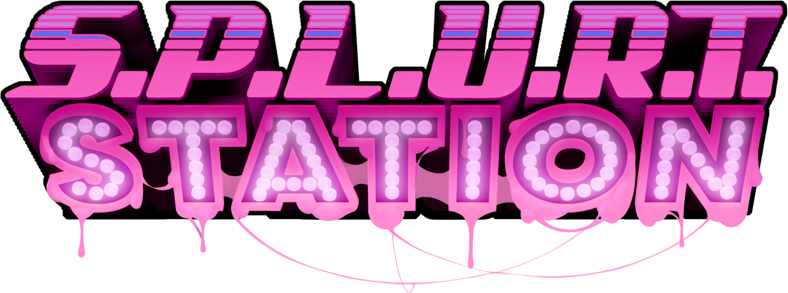

<p align="center">
  
</p>

<h1 align="center">S.P.L.U.R.T. Station Website</h1>

<p align="center">
  <strong>The official website for S.P.L.U.R.T. Station - a NSFW furry roleplaying server for Space Station 13</strong>
</p>

<p align="center">
  <a href="https://github.com/SPLURT-Station/splurt-webpage/actions/workflows/test.yml">
    
  </a>
  <a href="https://github.com/SPLURT-Station/splurt-webpage/actions/workflows/deploy-vps.yml">
    
  </a>
</p>

<p align="center">
  
  
  
  
  
</p>

<p align="center">
  <a href="https://splurt.space">🌐 Live Website</a>
</p>

---

## ✨ About

S.P.L.U.R.T. Station is a multiplayer sandbox roleplaying game built on Space Station 13. This repository contains the source code for the official website at [splurt.space](https://splurt.space).

The website features:

- 🎮 Information about the game and how to play
- 🖼️ Media gallery with screenshots and videos
- 🎵 Music player with YouTube playlist integration
- 📱 Responsive design with pixel-art aesthetics
- ⚡ Fast, static-first architecture with SSR capabilities

Inspired by <https://github.com/spacestation13/website>

## 🛠️ Tech Stack

| Category          | Technology                                                      |
| ----------------- | --------------------------------------------------------------- |
| **Framework**     | [Astro](https://astro.build/) 5.x                               |
| **Runtime**       | [Bun](https://bun.sh/)                                          |
| **UI Components** | [Solid.js](https://www.solidjs.com/)                            |
| **Styling**       | [Tailwind CSS](https://tailwindcss.com/) 4.x                    |
| **Linting**       | [Ultracite](https://github.com/haydenbleasel/ultracite) (Biome) |
| **Deployment**    | PM2 on VPS (Proxmox LXC)                                        |

## 📋 Prerequisites

- [Bun](https://bun.sh/) 1.x or later
- Node.js 18+ (for some dev dependencies)

## 🚀 Getting Started

### Installation

```bash
# Clone the repository
git clone https://github.com/SPLURT-Station/splurt-webpage.git
cd splurt-webpage

# Install dependencies
bun install
```

### Development Server

```bash
# Start the development server at http://localhost:4321
bun dev
```

### Building for Production

```bash
# Build the site to ./dist/
bun build

# Preview the production build locally
bun preview
```

## 📜 Available Scripts

| Command             | Description                                  |
| ------------------- | -------------------------------------------- |
| `bun dev`           | Start development server at `localhost:4321` |
| `bun build`         | Build production site to `./dist/`           |
| `bun preview`       | Preview production build locally             |
| `bun start`         | Run the production server (after build)      |
| `bun test`          | Run all tests                                |
| `bun test:watch`    | Run tests in watch mode                      |
| `bun test:coverage` | Run tests with coverage report               |
| `bun lint`          | Fix linting issues with Ultracite            |
| `bun lint:check`    | Check for linting issues without fixing      |

### PM2 Commands (Production)

| Command           | Description                    |
| ----------------- | ------------------------------ |
| `bun pm2:start`   | Start the application with PM2 |
| `bun pm2:stop`    | Stop the PM2 process           |
| `bun pm2:restart` | Restart the PM2 process        |
| `bun pm2:logs`    | View PM2 logs                  |
| `bun pm2:status`  | Check PM2 process status       |

## 📁 Project Structure

```
splurt-webpage/
├── .github/
│   └── workflows/          # GitHub Actions CI/CD
│       ├── deploy-vps.yml  # Production deployment
│       └── test.yml        # Testing workflow
├── public/                 # Static assets (fonts, images)
├── src/
│   ├── actions/           # Astro server actions
│   ├── assets/            # Processed assets (images, videos, logos)
│   ├── components/        # Reusable components
│   │   ├── age-gate/      # Age verification modal
│   │   ├── hero-header/   # Hero section component
│   │   ├── media-tabs/    # Media gallery tabs
│   │   ├── music-player/  # YouTube music player
│   │   ├── navigation/    # Site navigation
│   │   └── ...
│   ├── layouts/           # Page layouts
│   ├── pages/             # Route pages
│   ├── styles/            # Global styles (ITCSS architecture)
│   ├── test/              # Test files
│   └── utils/             # Utility functions
├── astro.config.mjs       # Astro configuration
├── tailwind.config.ts     # Tailwind CSS configuration
├── biome.json             # Biome/Ultracite configuration
└── package.json
```

## 🎨 Styling Architecture

This project uses the **ITCSS (Inverted Triangle CSS)** architecture combined with Tailwind CSS. See [`src/styles/README.md`](src/styles/README.md) for detailed documentation.

Key principles:

- Utility-first approach with Tailwind CSS
- Component-specific styles follow the **principle of locality** (CSS files live next to their components)
- Design tokens defined in CSS variables for consistency
- Custom pixel-art fonts for game-themed aesthetics

## 🧪 Testing

```bash
# Run all tests
bun test

# Run tests in watch mode
bun test:watch

# Run tests with coverage
bun test:coverage

# Run Astro type checking
bun astro check
```

See [`TESTING.md`](TESTING.md) for the complete testing guide.

## 🔧 Development

### Code Quality

This project uses [Ultracite](https://github.com/haydenbleasel/ultracite), a zero-config Biome preset for linting and formatting:

```bash
# Auto-fix linting issues
bun lint

# Check without fixing
bun lint:check
```

### Pre-commit Hooks

Husky is configured to run linting before each commit to ensure code quality.

### Environment Variables

Create a `.env` file based on the required secrets (see `.github/workflows/deploy-vps.yml` for the list of expected environment variables):

```env
# Media configuration
PUBLIC_MEDIA_SPLASH_SOURCE_TYPE=...
PUBLIC_MEDIA_SPLASH_BASE_URL=...
PUBLIC_MEDIA_SPLASH_PATTERNS=...

# YouTube integration
PUBLIC_YOUTUBE_PLAYLIST_ID=...
PUBLIC_YOUTUBE_API_KEY=...
```

## 🚢 Deployment

The site is automatically deployed to a VPS (Proxmox LXC container) via GitHub Actions when pushing to `main` or `master`.

### Deployment Workflow

1. **Tests** run on every push and PR (`.github/workflows/test.yml`)
2. **Deploy** runs on push to main/master (`.github/workflows/deploy-vps.yml`)
   - Builds the Astro site
   - Creates the production `.env` from GitHub secrets
   - Starts/restarts the PM2 process

### Manual Deployment

```bash
# Build the application
bun build

# Start with PM2
bun pm2:start

# Or run directly
bun start
```

## 🤝 Contributing

1. Fork the repository
2. Create a feature branch: `git checkout -b feature/amazing-feature`
3. Make your changes
4. Run tests: `bun test`
5. Run linting: `bun lint`
6. Commit your changes: `git commit -m 'Add amazing feature'`
7. Push to the branch: `git push origin feature/amazing-feature`
8. Open a Pull Request

---

<p align="center">
  Made with 💜 by the S.P.L.U.R.T. Station team
</p>
